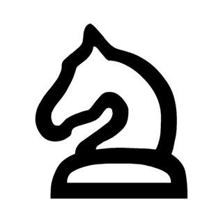

<p float="left">
    
    
    
    
    
    
    
    
    
    
    
    
</p>

Sample web UI for the fatpup chess engine based on Emscripten (`HTML + JS + WASM`).

## Get the code

```bash
git clone https://github.com/witaly-iwanow/fatpup-wasm.git
cd fatpup-wasm
```

`fatpup` is fetched automatically via CMake `FetchContent` (pinned commit).

## Build

Install and activate Emscripten SDK first (on Windows use an Emscripten-enabled shell, e.g. `emsdk_env.bat`), then:

```bat
emcmake cmake -S . -B _build
cmake --build _build -j
```

## Run

Serve the GitHub Pages directory:

```bash
cd docs
python3 -m http.server 8080
```

Open `http://localhost:8080`.


