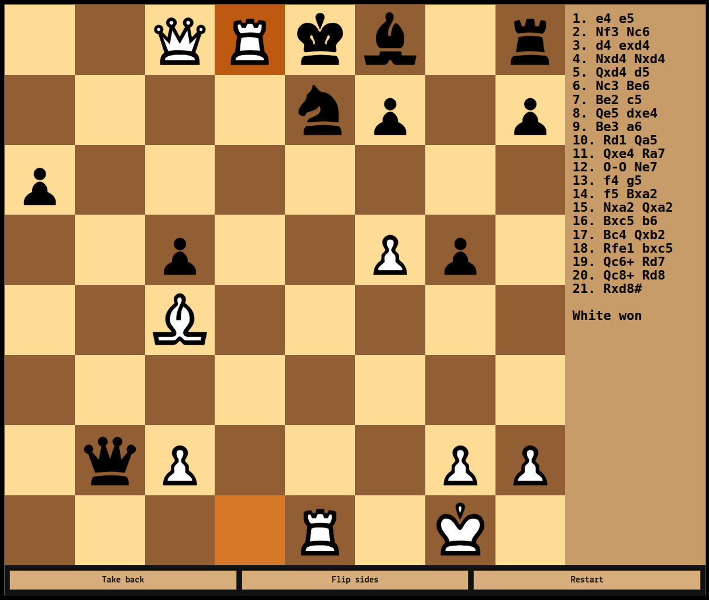

<p float="left">
    
    
    
    
    
    
    
    
    
    
    
    
</p>

Sample web UI for the [fatpup](https://github.com/witaly-iwanow/fatpup) chess engine, written in C++ and compiled for the web with Emscripten (`HTML + JS + WASM`). You can check out its online deployment [here](https://witaly-iwanow.github.io/fatpup-wasm/).

## Get the code

```bash
git clone https://github.com/witaly-iwanow/fatpup-wasm.git
cd fatpup-wasm
```

As opposed to older SDL and SFML integrations, this repo uses CMake FetchContent, instead of git submodules (not a fan, sorry).

## Build

Install and activate Emscripten SDK first (on Windows use an Emscripten-enabled shell, e.g. `emsdk_env.bat`), then:

```bat
emcmake cmake -S . -B build
cmake --build build -j
```

The static web assets (`index.html`, `styles.css`, `app.js`, `assets/`) live in `docs/`, and the build drops `fatpup_wasm.js` / `fatpup_wasm.wasm` alongside them. Keeping everything under `docs/` lets GitHub Pages serve the app straight from the repo with no extra deployment step.

## Run

Serve the output directory:

```bash
cd docs
python3 -m http.server 8080
```

Open http://localhost:8080.


